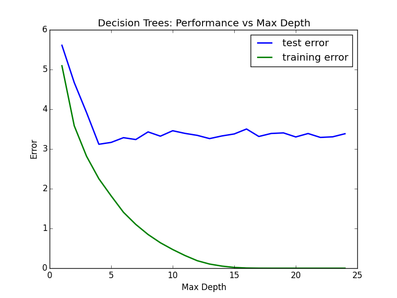

## Machine Learning Nanodegree
David Geretti - déc. 2015
# P1 : Predicting Boston Housing Prices

##1) Statistical analysis and data exploration

- Number of houses in dataset:  **506**
- Number of features:  **13**
- Minimum price:  **5.0**
- Maximum price:  **50.0**
- Mean price: **22.53**
- Median price:  **21.2**
- Std dev.: **9.19**

##2) Evaluating Model Performance
**Which measure of model performance is best to use for predicting Boston housing data and analyzing the errors? Why do you think this measurement most appropriate? Why might the other measurements not be appropriate here?**

> A regression metric is needed in this case. Housing prices are continuous.
> Common choices include Mean absolute error, Mean squared error, r-squared score.
> A real estate agent would be more interested by knowing how far from realty his model predicted a price, than knowing if the model predicted a perfect price

> **The mean absolute error** (`mean_absolute_error`) was chosen here because the calculated error has the same unit as the data (=> dollars). This is more intuitive to understand than a mean squared error for instance.
> The mean absolute error averages the (positive) distance between the prediction and the actual values.

**Why is it important to split the Boston housing data into training and testing data? What happens if you do not do this?**

> By training and testing the model on different datasets, we can measure how the model performs on unseen data.
> If we don't use a portion of the data for testing, we cannot see if our model is underfit or overfit, as we cannot compare testing and training errors.

**What does grid search do and why might you want to use it?**

> The parameters of an algorithm play a role in the quality of the model. For instance, the maximum depth allowed for a decision tree. 

> In order to make the best predictions, Grid Search is usefull to automatically try multiple value of said parameters and chose the optimal value. Otherwise, one would have to try all these possible values by hand.

**Why is cross validation useful and why might we use it with grid search?**

> Cross validation splits data into multiple different training/testing sets and measure the average error by running the model on all these sets.
> This maximizes the use of the available data. Otherwise we would have only on error measurement, and depending on how the data was split, it could be a value that does not really represent the model.

##3) Analyzing Model Performance
**Look at all learning curve graphs provided. What is the general trend of training and testing error as training size increases?**
> For small training sizes, the training error is low beacause it is easy for the model to find a perfect function fitting all the data points. This model will likely not be good for unknown datapoints though, thus the high testing error

> Both errors plateau around a single error value. What it means is that there is a minimum threshold of training size below which the error is unreliable. Bigger training size means better model and more accurate error measurement.

> The plateau seems to indicate that no matter how bigger the training size get, the algorithm we chosed will not be more accurate with the given parameter.
> For better performance, we may need to tune the parameters of the algorithm, or chose a different algorithm.

**Look at the learning curves for the decision tree regressor with max depth 1 and 10 (first and last learning curve graphs). When the model is fully trained does it suffer from either high bias/underfitting or high variance/overfitting?**
> With max_depth = 1, there is a higher bias than with max_depth = 10 because the error is high. This means the model cannot fully predict the data because of an oversimplified training.

> At max_depth = 10, there is a high variance => the gap between training and testing is the highest. No matter the size of the training size, it seems impossible for the model to predict the new data as good as the training data. The model is too closely linked to the training set.

**Look at the model complexity graph. How do the training and test error relate to increasing model complexity? Based on this relationship, which model (max depth) best generalizes the dataset and why?**
> The training error obviously tends to 0. The more complex the model, the best it can include every data point provided with the training set. Thus a smaller error.

> The testing error plateaus at some error value. No matter how much complexity is added, it doesn't help predict better on unknown data.

> Based on the image, the threshold for max_depth seems to be just after 5, where both the testing error and the model complexity are minimized. A less complexe model is better at generalizing data.

> Note : As the data is randomized, each try can be a little different. See next section.

##4) Model Prediction

**Model makes predicted housing price with detailed model parameters (max depth) reported using grid search. Note due to the small randomization of the code it is recommended to run the program several times to identify the most common/reasonable price/model complexity.**
> As said, data is randomized, making each program execution a little different. In the source code, I made `fit_predict_model` run 20 times to have a better idea of how different the optimal values of `max_depth` and the predicted price were each time.
> The result is consistent with the previously computed statistics (for the price), and the `max_depth` found in the graph at 3) :

> Averaged on 20 executions :
- Predicted price : **20.97** (std. dev.: 0.48)
- Max_depth : **5.32** (std. dev.: 0.98)

**Compare prediction to earlier statistics and make a case if you think it is a valid model.**

> With a mean price for the dataset equals to **22.53**, and a standard deviation of **9.19**, the predicted price is at a z-score of 

> $\frac{20.97 - 22.53}{9.19} = 0.17$

> - the predicted prices is within less than a standard deviation of the mean.
- the predicted price is very close to the median price of **21.2**

    
